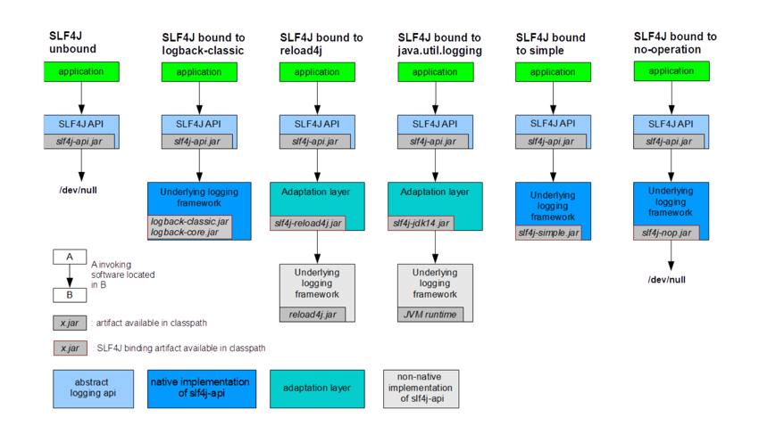

# 架构设计
是一个通用的日志框架，它提供了一个简单的日志接口，允许开发人员在不同的日志实现之间切换。
## 导入
1. 导入sl4j 核心jar包
2. 导入具体日志集成sl4j，sl4j 会自动收集对应的框架日志实现。切换只要切换不同的框架就行
   3. 自 2.0.9 版本起，您可以通过“slf4j.provider”系统属性显式指定提供程序类。这将绕过服务加载器机制来查找提供程序，并可能缩短 SLF4J 初始化时间。有关提供程序类名称的列表，请参阅相关的常见问题解答条目。
4. 从 SLF4J 1.6.0 版本开始，如果在类路径中找不到绑定，slf4j-api 将默认执行空操作，丢弃所有日志请求。因此，SLF4J 1.6.0 及更高版本不会NoClassDefFoundError因为 org.slf4j.impl.StaticLoggerBinder缺少类而抛出异常，而是会发出一条关于缺少绑定的警告信息，然后直接丢弃所有日志请求，不再发出任何警告
  
### logback
1. 导入logback 核心jar包
2. 配置logback.xml 或 logback-test.xml 文件
   3. logback.xml 或 logback-test.xml 文件位置
      1. 放在 src/main/resources 目录下
      2. 放在 src/test/resources 目录下
# 官方文档
[官方手册](https://www.slf4j.org/manual.html)